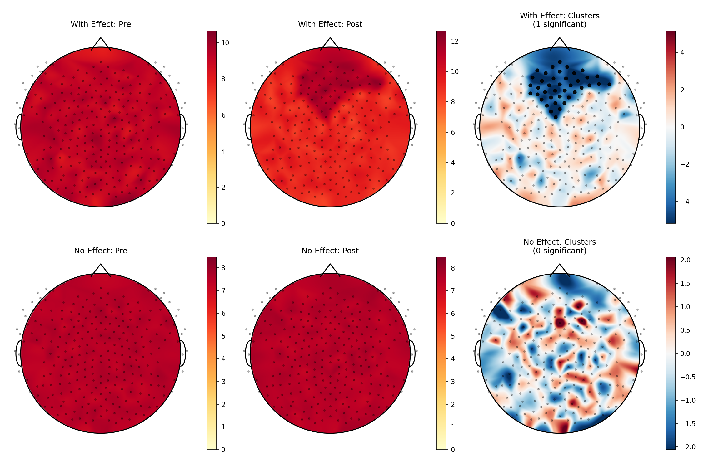

# EEG Topographic Analysis Package (eegtopo)

A clean, pip-installable Python package for EEG topographic mapping and cluster-based permutation testing.

## Features

- **Publication-quality topographic maps** with smooth interpolation covering the entire head
- **Cluster-based permutation testing** with automatic spatial adjacency
- **Simple DataFrame interface** - just bring your data, no complex setup required
- **Flexible threshold handling** - automatic, manual, or TFCE cluster-forming thresholds
- **Significance marking** - clearly visualize significant channels

## Example Results

The package includes example datasets demonstrating both significant effects and null results:



*Top row: Dataset with significant frontal alpha effect (GSN-HydroCel-256). Bottom row: Null data showing no significant clusters.*

## Installation

```bash
# Clone or download the package
cd eegtopo

# Install in development mode
pip install -e .

# Or install normally
pip install .
```

## Quick Start

```python
import pandas as pd
from eegtopo import TopographicAnalysis, run_cluster_analysis

# Your data - just needs subject, channel, value, and condition columns
df = pd.DataFrame({
    'subject': ['sub-01', 'sub-01', 'sub-02', 'sub-02', ...],
    'channel': ['E1', 'E1', 'E1', 'E1', ...],
    'condition': ['pre', 'post', 'pre', 'post', ...],
    'power': [1.2, 2.3, 1.1, 2.1, ...]
})

# Method 1: One-shot analysis
results = run_cluster_analysis(
    df,
    condition_a='pre',
    condition_b='post',
    value_col='power',
    plot=True,
    save_path='results.png'
)

print(f"Found {results['results'].n_sig_clusters} significant clusters")
print(results['results'].summary())

# Method 2: Object-oriented (more control)
analysis = TopographicAnalysis(df, value_col='power')

# Run cluster test with custom threshold
cluster_results = analysis.run_cluster_test(
    'pre', 'post',
    threshold=None,  # Auto-compute from t-distribution
    n_permutations=1024
)

# Plot the results
fig, ax, im = analysis.plot_cluster_results(cluster_results)

# Plot mean topomaps
fig, ax, im = analysis.plot_mean_topomap(condition='pre')
```

## Advanced Usage

### Custom Thresholds

```python
# Use automatic threshold (default - critical t for p<0.05)
results = analysis.run_cluster_test('pre', 'post', threshold=None)

# Use specific t-value
results = analysis.run_cluster_test('pre', 'post', threshold=2.0)

# Use TFCE (Threshold-Free Cluster Enhancement)
results = analysis.run_cluster_test('pre', 'post', threshold='tfce')

# Use MNE threshold dict
results = analysis.run_cluster_test('pre', 'post', threshold={'start': 0, 'step': 0.2})
```

### Working with Different Montages

```python
# Standard 10-20 system
analysis = TopographicAnalysis(df, montage_name='standard_1020')

# EGI 128-channel
analysis = TopographicAnalysis(df, montage_name='GSN-HydroCel-128')

# Exclude certain channels
analysis = TopographicAnalysis(
    df, 
    exclude_channels=['Cz', 'E67', 'E73']  # Reference and rim electrodes
)
```

### Manual Plotting

```python
# Plot custom values
values = {'E1': 1.5, 'E2': 2.3, 'E3': 0.8, ...}
fig, ax, im = analysis.plot_topomap(values, title="Custom Map")

# Plot with significance highlighting
sig_mask = np.array([True, False, True, ...])  # One per channel
fig, ax, im = analysis.plot_topomap(
    values, 
    sig_mask=sig_mask,
    title="Significant Channels Highlighted"
)
```

## Input Data Format

The DataFrame should have these columns (names are flexible):

- **Subject ID**: Column identifying subjects (e.g., 'subject', 'subj', 'participant')
- **Channel**: Channel names matching your montage (e.g., 'E1', 'Cz', 'Fz')
- **Value**: The measurement value (e.g., 'power', 'count', 'amplitude', 'density')
- **Condition**: Condition labels for paired comparisons (e.g., 'pre', 'post', 'stim')

Example:
```
   subject channel condition  power
0   sub-01      E1       pre    1.2
1   sub-01      E1      post    2.3
2   sub-01      E2       pre    0.8
3   sub-01      E2      post    1.9
...
```

## API Reference

### TopographicAnalysis

Main class for topographic analysis.

**Constructor Parameters:**
- `df`: Input DataFrame
- `subject_col`: Subject column name (default: 'subject')
- `channel_col`: Channel column name (default: 'channel')
- `value_col`: Value column name (default: 'value')
- `condition_col`: Condition column name (default: 'condition')
- `montage_name`: MNE montage name (default: 'GSN-HydroCel-256')
- `exclude_channels`: List of channels to exclude

**Methods:**
- `run_cluster_test(condition_a, condition_b, threshold, n_permutations, ...)` - Run cluster permutation test
- `plot_cluster_results(results, ...)` - Plot cluster test results
- `plot_mean_topomap(condition, ...)` - Plot mean values
- `plot_topomap(values, ...)` - Plot custom values

### run_cluster_analysis

Convenience function for one-shot analysis.

```python
run_cluster_analysis(
    df,
    condition_a='pre',
    condition_b='post',
    threshold=None,  # or float, 'tfce', dict
    n_permutations=1024,
    plot=True,
    save_path='output.png'
)
```

## Requirements

- Python >= 3.8
- numpy >= 1.20.0
- scipy >= 1.7.0
- matplotlib >= 3.3.0
- pandas >= 1.3.0
- mne >= 1.0.0

## License

MIT License

## Citation

If you use this package in your research, please cite:

```
EEG Topographic Analysis Package (eegtopo), 2024
https://github.com/yourusername/eegtopo
```
